Who Wrote the Disputed Essays?
================

## Step 0 Goal <br>

The goal is to find which person wrote the dispute essays, Hamilton or
Madison, using a clustering algorithm with the K-Means and
HAC(Hierarchical Algorithm Clustering) functions. <br> - To provide
evidence for each function to demonstrate the learned patterns. <br> -
To figure out the location of the papers with joint authorship.

------------------------------------------------------------------------

### Historical Background

The Federalist Papers were a series of eighty-five essays urging the
citizens of New York to ratify the new United States Constitution.

Written by Alexander Hamilton, James Madison, and John Jay, the essays
orignially appeared anonymously in New York newspapers in 1787 and 1788
under the pen name “Publius.”

A bound edition of the essays was first published in 1788, but it was
not until the 1818 edition published by the printer Jacob Gideon that
the authors of each essay were identified by name. The Federalist Papers
are considered one of the most important sources for interpreting and
understanding the original intent of the Constitution.

About the disputed authorship, the original essays can be downloaded
from the Library of Congress.
<http://thomas.loc.gov/home/histdox/fedpapers.html><br>

Research guides: Federalist papers: Primary documents in American
history: Introduction. Introduction - Federalist Papers: Primary
Documents in American History - Research Guides at Library of Congress.
(n.d.). Retrieved March 4, 2023, from
<http://www.loc.gov/rr/program/bib/ourdocs/federalist.html>

------------------------------------------------------------------------

## Step 1 Collecting data

### Install and Load R Packages

We must install and load some R packages as following before starting
the analysis. <br> 1. **RWeka**: weka (deep learning) implemenation in R
<br> - <https://cran.r-project.org/web/packages/RWeka/RWeka.pdf> <br> 2.
**tidyverse**: data manipulation <br> -
<https://cran.r-project.org/web/packages/tidyverse/tidyverse.pdf> <br>
3. **cluster**: clustering algorithms <br>
<https://cran.r-project.org/web/packages/cluster/cluster.pdf> <br> 4.
**factoextra**: clustering algorithms and visualization <br> -
<https://rpkgs.datanovia.com/factoextra/index.html> <br> -
<https://cran.r-project.org/web/packages/factoextra/factoextra.pdf> <br>
5. **gridExtra**: for the layout of subfigures <br> -
<https://cran.r-project.org/web/packages/gridExtra/gridExtra.pdf> <br>
6. **stats**: for using the k-means algorithm <br>
<https://stat.ethz.ch/R-manual/R-devel/library/stats/html/00Index.html>
<br> 7. **dendextend**: for comparing two dendrograms <br>
<https://cran.r-project.org/web/packages/dendextend/vignettes/dendextend.html>
<br>

``` r
#install.packages('RWeka')      # Weka implementation in R
#install.packages('tidyverse')  # data manipulation
#install.packages('cluster')    # clustering algorithms
#install.packages('factoextra') # clustering algorithms & visualization
#install.packages('gridExtra')  # for the layout of subfigures
#install.packages('dendextend') # for comparing two dendrograms
```

``` r
library('RWeka')    
library('tidyverse')  
```

    ## ── Attaching packages ─────────────────────────────────────── tidyverse 1.3.2 ──
    ## ✔ ggplot2 3.4.0      ✔ purrr   0.3.4 
    ## ✔ tibble  3.1.8      ✔ dplyr   1.0.10
    ## ✔ tidyr   1.2.1      ✔ stringr 1.4.1 
    ## ✔ readr   2.1.3      ✔ forcats 0.5.2 
    ## ── Conflicts ────────────────────────────────────────── tidyverse_conflicts() ──
    ## ✖ dplyr::filter() masks stats::filter()
    ## ✖ dplyr::lag()    masks stats::lag()

``` r
library('cluster')    
library('factoextra') 
```

    ## Welcome! Want to learn more? See two factoextra-related books at https://goo.gl/ve3WBa

``` r
library('gridExtra')  
```

    ## 
    ## Attaching package: 'gridExtra'
    ## 
    ## The following object is masked from 'package:dplyr':
    ## 
    ##     combine

``` r
library('stats')
library('dendextend')
```

    ## 
    ## ---------------------
    ## Welcome to dendextend version 1.16.0
    ## Type citation('dendextend') for how to cite the package.
    ## 
    ## Type browseVignettes(package = 'dendextend') for the package vignette.
    ## The github page is: https://github.com/talgalili/dendextend/
    ## 
    ## Suggestions and bug-reports can be submitted at: https://github.com/talgalili/dendextend/issues
    ## You may ask questions at stackoverflow, use the r and dendextend tags: 
    ##   https://stackoverflow.com/questions/tagged/dendextend
    ## 
    ##  To suppress this message use:  suppressPackageStartupMessages(library(dendextend))
    ## ---------------------
    ## 
    ## 
    ## Attaching package: 'dendextend'
    ## 
    ## The following object is masked from 'package:stats':
    ## 
    ##     cutree

------------------------------------------------------------------------

## Step 2 Uploading, Exploring, and Preparing the Data

### Upload the dataset

``` r
paper <- read.csv("/Users/jenkim/Desktop/SU ADS/IST 707/Week 4/Notes (Lecture)/hw/HW4-data-fedPapers85(1).csv")
```

### Explore the dataset

``` r
str(paper)
```

    ## 'data.frame':    85 obs. of  72 variables:
    ##  $ author  : chr  "dispt" "dispt" "dispt" "dispt" ...
    ##  $ filename: chr  "dispt_fed_49.txt" "dispt_fed_50.txt" "dispt_fed_51.txt" "dispt_fed_52.txt" ...
    ##  $ a       : num  0.28 0.177 0.339 0.27 0.303 0.245 0.349 0.414 0.248 0.442 ...
    ##  $ all     : num  0.052 0.063 0.09 0.024 0.054 0.059 0.036 0.083 0.04 0.062 ...
    ##  $ also    : num  0.009 0.013 0.008 0.016 0.027 0.007 0.007 0.009 0.007 0.006 ...
    ##  $ an      : num  0.096 0.038 0.03 0.024 0.034 0.067 0.029 0.018 0.04 0.075 ...
    ##  $ and     : num  0.358 0.393 0.301 0.262 0.404 0.282 0.335 0.478 0.356 0.423 ...
    ##  $ any     : num  0.026 0.063 0.008 0.056 0.04 0.052 0.058 0.046 0.034 0.037 ...
    ##  $ are     : num  0.131 0.051 0.068 0.064 0.128 0.111 0.087 0.11 0.154 0.093 ...
    ##  $ as      : num  0.122 0.139 0.203 0.111 0.148 0.252 0.073 0.074 0.161 0.1 ...
    ##  $ at      : num  0.017 0.114 0.023 0.056 0.013 0.015 0.116 0.037 0.047 0.031 ...
    ##  $ be      : num  0.411 0.393 0.474 0.365 0.344 0.297 0.378 0.331 0.289 0.379 ...
    ##  $ been    : num  0.026 0.165 0.015 0.127 0.047 0.03 0.044 0.046 0.027 0.025 ...
    ##  $ but     : num  0.009 0 0.038 0.032 0.061 0.037 0.007 0.055 0.027 0.037 ...
    ##  $ by      : num  0.14 0.139 0.173 0.167 0.209 0.186 0.102 0.092 0.168 0.174 ...
    ##  $ can     : num  0.035 0 0.023 0.056 0.088 0 0.058 0.037 0.047 0.056 ...
    ##  $ do      : num  0.026 0.013 0 0 0 0 0.015 0.028 0 0 ...
    ##  $ down    : num  0 0 0.008 0 0 0.007 0 0 0 0 ...
    ##  $ even    : num  0.009 0.025 0.015 0.024 0.02 0.007 0.007 0.018 0 0.006 ...
    ##  $ every   : num  0.044 0 0.023 0.04 0.027 0.007 0.087 0.064 0.081 0.05 ...
    ##  $ for.    : num  0.096 0.076 0.098 0.103 0.141 0.067 0.116 0.055 0.127 0.1 ...
    ##  $ from    : num  0.044 0.101 0.053 0.079 0.074 0.096 0.08 0.083 0.074 0.124 ...
    ##  $ had     : num  0.035 0.101 0.008 0.016 0 0.022 0.015 0.009 0.007 0 ...
    ##  $ has     : num  0.017 0.013 0.015 0.024 0.054 0.015 0.036 0.037 0.02 0.019 ...
    ##  $ have    : num  0.044 0.152 0.023 0.143 0.047 0.119 0.044 0.074 0.074 0.044 ...
    ##  $ her     : num  0 0 0 0 0 0 0.007 0 0.034 0.025 ...
    ##  $ his     : num  0.017 0 0 0.024 0.02 0.067 0 0.018 0.02 0.05 ...
    ##  $ if.     : num  0 0.025 0.023 0.04 0.034 0.03 0.029 0 0 0.025 ...
    ##  $ in.     : num  0.262 0.291 0.308 0.238 0.263 0.401 0.189 0.267 0.248 0.274 ...
    ##  $ into    : num  0.009 0.025 0.038 0.008 0.013 0.037 0 0.037 0.013 0.037 ...
    ##  $ is      : num  0.157 0.038 0.15 0.151 0.189 0.26 0.167 0.083 0.208 0.23 ...
    ##  $ it      : num  0.175 0.127 0.173 0.222 0.108 0.156 0.102 0.165 0.134 0.131 ...
    ##  $ its     : num  0.07 0.038 0.03 0.048 0.013 0.015 0 0.046 0.02 0.019 ...
    ##  $ may     : num  0.035 0.038 0.12 0.056 0.047 0.074 0.08 0.092 0.027 0.106 ...
    ##  $ more    : num  0.026 0 0.038 0.056 0.067 0.045 0.08 0.064 0.06 0.081 ...
    ##  $ must    : num  0.026 0.013 0.083 0.071 0.013 0.015 0.044 0.018 0.027 0.068 ...
    ##  $ my      : num  0 0 0 0 0 0 0.007 0 0 0 ...
    ##  $ no      : num  0.035 0 0.03 0.032 0.047 0.059 0.022 0.018 0.02 0.044 ...
    ##  $ not     : num  0.114 0.127 0.068 0.087 0.128 0.134 0.102 0.101 0.094 0.106 ...
    ##  $ now     : num  0 0 0 0 0 0 0.007 0 0.007 0.012 ...
    ##  $ of      : num  0.9 0.747 0.858 0.802 0.869 ...
    ##  $ on      : num  0.14 0.139 0.15 0.143 0.054 0.141 0.051 0.083 0.127 0.118 ...
    ##  $ one     : num  0.026 0.025 0.03 0.032 0.047 0.052 0.073 0.046 0.06 0.031 ...
    ##  $ only    : num  0.035 0 0.023 0.048 0.027 0.022 0.007 0.046 0.02 0.012 ...
    ##  $ or      : num  0.096 0.114 0.06 0.064 0.081 0.074 0.153 0.037 0.154 0.081 ...
    ##  $ our     : num  0.017 0 0 0.016 0.027 0.03 0.051 0 0.007 0.025 ...
    ##  $ shall   : num  0.017 0 0.008 0.016 0 0.015 0.007 0 0.02 0 ...
    ##  $ should  : num  0.017 0.013 0.068 0.032 0 0.03 0.007 0 0 0.012 ...
    ##  $ so      : num  0.035 0.013 0.038 0.04 0.027 0.007 0.051 0.018 0.04 0.05 ...
    ##  $ some    : num  0.009 0.063 0.03 0.024 0.067 0.045 0.007 0.028 0.027 0.025 ...
    ##  $ such    : num  0.026 0 0.045 0.008 0.027 0.015 0.015 0 0.013 0.031 ...
    ##  $ than    : num  0.009 0 0.023 0 0.047 0.03 0.109 0.055 0.067 0.044 ...
    ##  $ that    : num  0.184 0.152 0.188 0.238 0.162 0.208 0.233 0.165 0.208 0.218 ...
    ##  $ the     : num  1.43 1.25 1.49 1.33 1.19 ...
    ##  $ their   : num  0.114 0.165 0.053 0.071 0.027 0.089 0.109 0.083 0.154 0.081 ...
    ##  $ then    : num  0 0 0.015 0.008 0.007 0.007 0.015 0.009 0.007 0.012 ...
    ##  $ there   : num  0.009 0 0.015 0 0.007 0.007 0.036 0.028 0.02 0 ...
    ##  $ things  : num  0.009 0 0 0 0 0 0 0 0 0.012 ...
    ##  $ this    : num  0.044 0.051 0.075 0.103 0.094 0.126 0.08 0.11 0.067 0.093 ...
    ##  $ to      : num  0.507 0.355 0.361 0.532 0.485 0.445 0.56 0.34 0.49 0.498 ...
    ##  $ up      : num  0 0 0 0 0 0 0.007 0 0 0 ...
    ##  $ upon    : num  0 0.013 0 0 0 0 0 0 0 0 ...
    ##  $ was     : num  0.009 0.051 0.008 0.087 0.027 0.007 0.015 0.018 0.027 0 ...
    ##  $ were    : num  0.017 0 0.015 0.079 0.02 0.03 0.029 0.009 0.007 0 ...
    ##  $ what    : num  0 0 0.008 0.008 0.02 0.015 0.015 0.009 0.02 0.025 ...
    ##  $ when    : num  0.009 0 0 0.024 0.007 0.037 0.007 0 0.02 0.012 ...
    ##  $ which   : num  0.175 0.114 0.105 0.167 0.155 0.186 0.211 0.175 0.201 0.199 ...
    ##  $ who     : num  0.044 0.038 0.008 0 0.027 0.045 0.022 0.018 0.04 0.031 ...
    ##  $ will    : num  0.009 0.089 0.173 0.079 0.168 0.111 0.145 0.267 0.154 0.106 ...
    ##  $ with    : num  0.087 0.063 0.045 0.079 0.074 0.089 0.073 0.129 0.027 0.081 ...
    ##  $ would   : num  0.192 0.139 0.068 0.064 0.04 0.037 0.073 0.037 0.04 0.031 ...
    ##  $ your    : num  0 0 0 0 0 0 0 0 0 0 ...

The paper dataset has information on 85 essays with 72 features,
including the name of the author, the file name, and the rest, which
indicates the percentage of occurrence for each word in one essay. <br>
<br> 1. The number of essays for each author is given as the following.
The 11 reputed essays are the targets in this project for predicting
authorship. <br> - 51 essays written by Hamilton***(Hamilton)*** <br> -
15 essays by Madison***(Madison)*** <br> - 3 essays by Hamilton and
Madison***(HM)*** <br> - 5 essays by Jay***(Jay)***. <br> - 11 reputed
essays ***(dispt)*** <br> <br> 2. The following formula calculates the
percentage of occurrences of each word in an essay, and the values are
in the seventy remaining features.<br> (The number of occurrences of the
word in an essay / the total number of word counts in an essay) \* 100
<br>

``` r
head(paper, 5)
```

    ##   author         filename     a   all  also    an   and   any   are    as    at
    ## 1  dispt dispt_fed_49.txt 0.280 0.052 0.009 0.096 0.358 0.026 0.131 0.122 0.017
    ## 2  dispt dispt_fed_50.txt 0.177 0.063 0.013 0.038 0.393 0.063 0.051 0.139 0.114
    ## 3  dispt dispt_fed_51.txt 0.339 0.090 0.008 0.030 0.301 0.008 0.068 0.203 0.023
    ## 4  dispt dispt_fed_52.txt 0.270 0.024 0.016 0.024 0.262 0.056 0.064 0.111 0.056
    ## 5  dispt dispt_fed_53.txt 0.303 0.054 0.027 0.034 0.404 0.040 0.128 0.148 0.013
    ##      be  been   but    by   can    do  down  even every  for.  from   had   has
    ## 1 0.411 0.026 0.009 0.140 0.035 0.026 0.000 0.009 0.044 0.096 0.044 0.035 0.017
    ## 2 0.393 0.165 0.000 0.139 0.000 0.013 0.000 0.025 0.000 0.076 0.101 0.101 0.013
    ## 3 0.474 0.015 0.038 0.173 0.023 0.000 0.008 0.015 0.023 0.098 0.053 0.008 0.015
    ## 4 0.365 0.127 0.032 0.167 0.056 0.000 0.000 0.024 0.040 0.103 0.079 0.016 0.024
    ## 5 0.344 0.047 0.061 0.209 0.088 0.000 0.000 0.020 0.027 0.141 0.074 0.000 0.054
    ##    have her   his   if.   in.  into    is    it   its   may  more  must my
    ## 1 0.044   0 0.017 0.000 0.262 0.009 0.157 0.175 0.070 0.035 0.026 0.026  0
    ## 2 0.152   0 0.000 0.025 0.291 0.025 0.038 0.127 0.038 0.038 0.000 0.013  0
    ## 3 0.023   0 0.000 0.023 0.308 0.038 0.150 0.173 0.030 0.120 0.038 0.083  0
    ## 4 0.143   0 0.024 0.040 0.238 0.008 0.151 0.222 0.048 0.056 0.056 0.071  0
    ## 5 0.047   0 0.020 0.034 0.263 0.013 0.189 0.108 0.013 0.047 0.067 0.013  0
    ##      no   not now    of    on   one  only    or   our shall should    so  some
    ## 1 0.035 0.114   0 0.900 0.140 0.026 0.035 0.096 0.017 0.017  0.017 0.035 0.009
    ## 2 0.000 0.127   0 0.747 0.139 0.025 0.000 0.114 0.000 0.000  0.013 0.013 0.063
    ## 3 0.030 0.068   0 0.858 0.150 0.030 0.023 0.060 0.000 0.008  0.068 0.038 0.030
    ## 4 0.032 0.087   0 0.802 0.143 0.032 0.048 0.064 0.016 0.016  0.032 0.040 0.024
    ## 5 0.047 0.128   0 0.869 0.054 0.047 0.027 0.081 0.027 0.000  0.000 0.027 0.067
    ##    such  than  that   the their  then there things  this    to up  upon   was
    ## 1 0.026 0.009 0.184 1.425 0.114 0.000 0.009  0.009 0.044 0.507  0 0.000 0.009
    ## 2 0.000 0.000 0.152 1.254 0.165 0.000 0.000  0.000 0.051 0.355  0 0.013 0.051
    ## 3 0.045 0.023 0.188 1.490 0.053 0.015 0.015  0.000 0.075 0.361  0 0.000 0.008
    ## 4 0.008 0.000 0.238 1.326 0.071 0.008 0.000  0.000 0.103 0.532  0 0.000 0.087
    ## 5 0.027 0.047 0.162 1.193 0.027 0.007 0.007  0.000 0.094 0.485  0 0.000 0.027
    ##    were  what  when which   who  will  with would your
    ## 1 0.017 0.000 0.009 0.175 0.044 0.009 0.087 0.192    0
    ## 2 0.000 0.000 0.000 0.114 0.038 0.089 0.063 0.139    0
    ## 3 0.015 0.008 0.000 0.105 0.008 0.173 0.045 0.068    0
    ## 4 0.079 0.008 0.024 0.167 0.000 0.079 0.079 0.064    0
    ## 5 0.020 0.020 0.007 0.155 0.027 0.168 0.074 0.040    0

This is how the paper looks like. <br>

### Handle Missing Values

``` r
nrow(paper[is.na(paper),])
```

    ## [1] 0

``` r
# paper <- na.omit(paper)
```

There is no missing value in all features in the paper dataset, which
makes the analysis more convenient.

### Select the required data

``` r
paper_unlabeled <- paper[paper$author != "Jay",]
nrow(paper_unlabeled)
```

    ## [1] 80

Considering the goal (Defining the authorship of the 11 disputed essays
between Hamilton and Madison), remove all essays written by Jay for
improving the accuracy of the prediction. <br> <br> After removing Jay’s
essays, there remain 80 rows in the dataset.

### Remove the labels

``` r
paper_unlabeled <- paper_unlabeled[,c(-1:-2)]
head(paper_unlabeled, 2)
```

    ##       a   all  also    an   and   any   are    as    at    be  been   but    by
    ## 1 0.280 0.052 0.009 0.096 0.358 0.026 0.131 0.122 0.017 0.411 0.026 0.009 0.140
    ## 2 0.177 0.063 0.013 0.038 0.393 0.063 0.051 0.139 0.114 0.393 0.165 0.000 0.139
    ##     can    do down  even every  for.  from   had   has  have her   his   if.
    ## 1 0.035 0.026    0 0.009 0.044 0.096 0.044 0.035 0.017 0.044   0 0.017 0.000
    ## 2 0.000 0.013    0 0.025 0.000 0.076 0.101 0.101 0.013 0.152   0 0.000 0.025
    ##     in.  into    is    it   its   may  more  must my    no   not now    of
    ## 1 0.262 0.009 0.157 0.175 0.070 0.035 0.026 0.026  0 0.035 0.114   0 0.900
    ## 2 0.291 0.025 0.038 0.127 0.038 0.038 0.000 0.013  0 0.000 0.127   0 0.747
    ##      on   one  only    or   our shall should    so  some  such  than  that
    ## 1 0.140 0.026 0.035 0.096 0.017 0.017  0.017 0.035 0.009 0.026 0.009 0.184
    ## 2 0.139 0.025 0.000 0.114 0.000 0.000  0.013 0.013 0.063 0.000 0.000 0.152
    ##     the their then there things  this    to up  upon   was  were what  when
    ## 1 1.425 0.114    0 0.009  0.009 0.044 0.507  0 0.000 0.009 0.017    0 0.009
    ## 2 1.254 0.165    0 0.000  0.000 0.051 0.355  0 0.013 0.051 0.000    0 0.000
    ##   which   who  will  with would your
    ## 1 0.175 0.044 0.009 0.087 0.192    0
    ## 2 0.114 0.038 0.089 0.063 0.139    0

``` r
nrow(paper_unlabeled)
```

    ## [1] 80

Make the dataset unlabeled by removing the label information (the author
and file name columns) for building the clustering model.

------------------------------------------------------------------------

## Step 3 Model Training for Data

### Normalize all numeric predictors

``` r
paper_unlabeled <- scale(paper_unlabeled)
nrow(paper_unlabeled)
```

    ## [1] 80

Set all predictive variables in the same scale using Z-Scored
Normalization.

### Hierarchical Clustering Algorithms

**hclust() function**<br> Compute the dissimilarity values (distances)
with the dist() function and the method = “euclidean” parameter
(Euclidean Distnace).

``` r
d_paper <- dist(paper_unlabeled, method = "euclidean")
```

Feed the values into the **hclust()** function and specify the
agglomeration method to be used. (i.e. complete, average, single,
ward.D) After completed, draw the dendrogram of each result.<br>

``` r
# assign method options vector
method_options_hclust <- c("average", "single", "complete", "ward.D")

i = 1
# create a function to compute hclust with each method option and plot the dendrogram
for (options in method_options_hclust) {
  hc_paper_i <- hclust(d_paper, method = options)
  plot(hc_paper_i, cex = 0.6, hang = -1)
  rect.hclust(hc_paper_i, k=4, border = 2:5)
  i <- i + 1
}
```

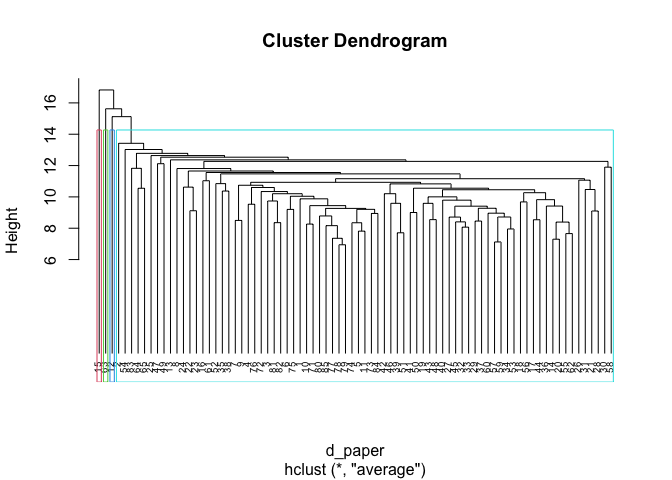<!-- -->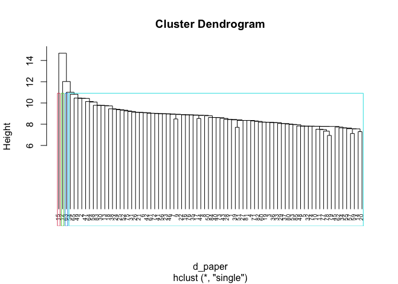<!-- -->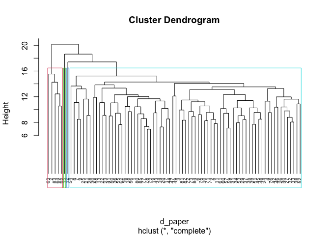<!-- -->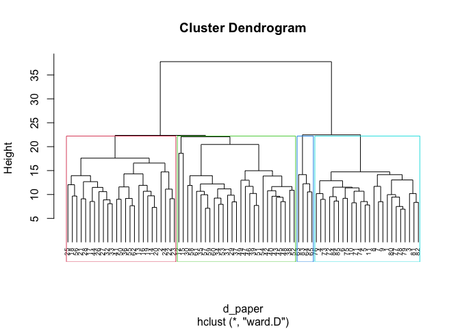<!-- -->

As seen in the above dendrograms, the clusters on the plot with the
ward.D method option can be distinguished visibly. Also, the clustering
algorithm with the method = ward.D parameter can be the best
optimization because the heights of each cluster in this model are the
shortest among other method options.

**agnes()** Compare the agglomerative coefficient of each method option
to find the best for further analysis.

``` r
# assign the method option vectors
method_options_agnes <- c( "average", "single", "complete", "ward")
names(method_options_agnes) <- c( "average", "single", "complete", "ward")

# create a list to store agglomerative coefficient
ac.values <- vector(mode = "list", length = length(method_options_agnes))

i = 1
# function to calculate coefficient
for (options in method_options_agnes) {
  hc_ag_paper_i <- agnes(paper_unlabeled, method = options)
  ac.values[i] <- hc_ag_paper_i$ac
  pltree(hc_ag_paper_i, cex = 0.6, hang = -1, main = "Dendrogram of agnes")
  rect.hclust(hc_ag_paper_i, k=4, border = 2:5)
  i <- i + 1
}
```

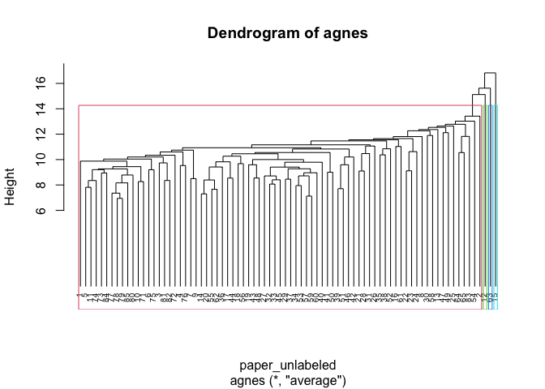<!-- -->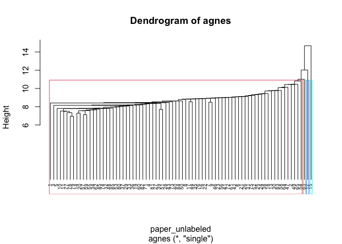<!-- -->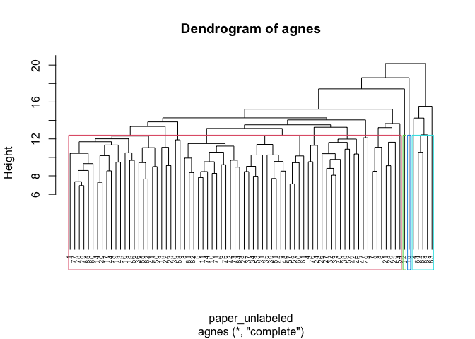<!-- -->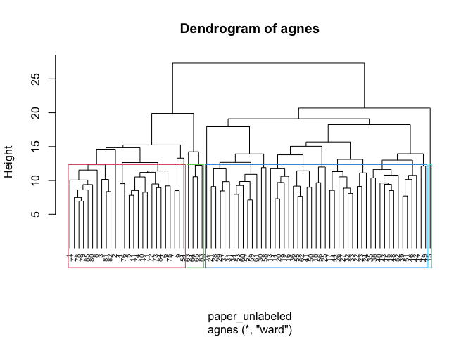<!-- -->

``` r
names(ac.values) <- c( "average", "single", "complete", "ward")
ac.values
```

    ## $average
    ## [1] 0.4305752
    ## 
    ## $single
    ## [1] 0.4066425
    ## 
    ## $complete
    ## [1] 0.5215408
    ## 
    ## $ward
    ## [1] 0.6457493

The agglomerative coefficient with the method = ward parameter is the
highest value, about 0.67. However, this value can’t support the fact
that this clustering model with this parameter has a strong structure
because its coefficient is not extremely close to 1. <br> <br> In the
dendrogram of the clustering model mentioned above, the boundaries of
each cluster are clear, and its heights are the shortest value among
other methods, which fulfills the goal of clustering, finding the
minimum distance between clusters as the best.

### Divisive Hierarchical Clustering

**1. diana()** <br> Find the heterogeneous clusters are divided from a
single cluster, including all instances, to groups through iteration
using the diana() function.

``` r
hc_paper_d <- diana(paper_unlabeled)
```

calculate the coefficient of this divisive clustering.

``` r
hc_paper_d$dc
```

    ## [1] 0.5101729

Make a visualization of the results using a dendrogram.

``` r
pltree(hc_paper_d, cex = 0.6, hang = -1, main = "Dendrogram of diana")
rect.hclust(hc_paper_d, k = 4, border = 2:5)
```

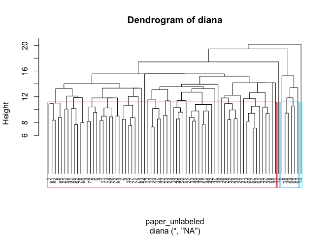<!-- -->

The clustering algorithm cannot be defined as a strong model because the
coefficient of the divisive clustering algorithm is 0.4916942, not
extremely close to 1. <br> <br> In addition, the red color cluster in
the above dendrogram has the most instances, compared to other clusters.
In other words, it can be said that all the objects aren’t divided into
the clusters in balance.

### Kmeans Clustering

**SimpleKMeans()** <br> The SimpleKMeans() function comes from the RWaka
package and it doesn’t care the type of data. <br>

``` r
model_rweka_paper <- SimpleKMeans(paper_unlabeled, control = Weka_control(N = 4, I = 500, S = 100))
model_rweka_paper
```

    ## 
    ## kMeans
    ## ======
    ## 
    ## Number of iterations: 5
    ## Within cluster sum of squared errors: 216.82639346133936
    ## 
    ## Initial starting points (random):
    ## 
    ## Cluster 0: -2.363558,0.004704,0.893064,-0.815348,0.736738,-0.642619,-0.850304,0.755748,-0.686236,0.592665,-0.63651,-0.63936,-1.034911,-1.274248,-0.942856,-0.439344,-0.466519,0.491706,-0.323618,-0.952655,-0.32586,-0.741333,0.558989,-0.369363,-0.525396,0.510464,-0.952189,-0.166987,-0.176624,-0.871138,-0.280365,-0.036763,2.130756,0.289882,0.443777,0.39244,-0.815162,-0.870862,0.540705,-0.379146,-0.583971,-1.054387,-1.066882,0.231223,-0.977663,-0.618388,-1.397617,-0.836337,-0.928752,0.697889,-0.106389,3.181807,-0.859039,1.354699,-0.591145,-0.614954,-1.988615,-0.918638,-0.532032,-1.131123,-0.201412,0.361422,-0.507794,-0.85885,-1.092454,-1.045655,1.867774,0.89787,-0.36775,-0.186296
    ## Cluster 1: 0.305839,-0.789814,-0.867907,-0.038406,1.891908,-1.810035,0.846583,0.294222,-0.107541,-2.044613,0.684114,-0.979974,-0.994788,-0.775067,-0.942856,-0.439344,-1.170699,-0.987521,-0.267942,0.719003,0.285468,0.145043,1.985907,0.304394,-0.20349,-0.293904,0.722603,1.554837,-2.29178,-1.77142,-1.665298,-1.343879,0.531536,-1.076632,-0.407302,-1.738691,0.710287,0.145144,1.496369,-1.395281,-0.895423,-1.054387,1.108883,0.265799,-0.614364,-0.618388,-0.504163,0.535778,-0.928752,-0.030176,-0.964508,-1.267554,0.226594,-1.004963,0.352889,-0.614954,-0.689928,-1.581146,-0.532032,-0.1074,1.505469,0.756824,0.137024,-0.85885,-0.323289,0.758865,-0.847586,-0.066545,-0.848375,-0.186296
    ## Cluster 2: -0.379354,-0.83163,-0.238989,0.208803,-0.329572,0.049183,-0.403755,0.212777,-1.187772,0.187819,-0.575086,1.51786,-0.212399,1.827803,1.207855,0.912483,-0.164728,0.491706,-0.713351,1.934754,-0.32586,-0.660753,-0.087163,-0.369363,-0.456416,0.201092,-0.156663,-0.76072,1.331725,0.906342,0.293876,0.486084,-0.985673,1.375055,-0.407302,2.523571,-0.156445,1.161149,-0.223827,-0.531566,-0.220611,0.895507,-0.020312,-0.35656,-0.251065,-0.087013,0.006382,-0.640321,0.412406,0.199739,1.995125,0.819087,1.842422,0.68051,0.937291,0.50825,0.428387,0.661916,-0.532032,0.294778,-0.542788,-0.725934,-0.231444,-0.474147,-0.058889,-0.315254,-0.677876,-0.7995,-0.120156,-0.186296
    ## Cluster 3: -1.407143,-0.789814,-0.867907,-0.00309,0.533631,-1.031758,-0.433525,0.267074,-0.377599,-1.871108,2.711119,0.212174,-0.774114,-0.347198,-0.942856,-0.439344,2.350201,-1.371024,-0.629837,-1.332577,0.198136,2.441563,2.416675,-0.369363,0.325354,0.015469,-0.407882,-0.820093,-0.020588,-0.086277,-0.787048,-1.180489,-0.698634,-0.312992,-0.407302,-0.387242,0.190248,0.435431,0.007545,-1.090441,-0.63588,1.61769,-1.342296,-0.391135,1.305929,-0.884076,2.11238,-0.705659,-0.66052,0.046462,-1.209684,0.902553,-1.41448,0.511962,-0.411329,-0.614954,-0.040584,1.750322,0.762101,0.806639,-0.576926,-0.97306,-1.152612,-0.85885,1.431367,0.930724,-1.094437,1.052176,-0.819246,-0.186296
    ## 
    ## Missing values globally replaced with mean/mode
    ## 
    ## Final cluster centroids:
    ##                          Cluster#
    ## Attribute    Full Data          0          1          2          3
    ##                 (80.0)     (25.0)     (14.0)     (34.0)      (7.0)
    ## ==================================================================
    ## a                    0    -0.1213    -0.3039     0.2546    -0.1958
    ## all                  0     0.1235     0.2018    -0.1318    -0.2044
    ## also                 0     0.5308      -0.23    -0.3204     0.1204
    ## an                   0    -0.5837    -0.2301     0.4404     0.4056
    ## and                 -0     0.1929     0.6733    -0.3677    -0.2498
    ## any                  0    -0.2846    -0.6581     0.4854    -0.0249
    ## are                 -0     0.3274     0.1087    -0.1043    -0.8801
    ## as                  -0     0.2823    -0.3767    -0.0914     0.1895
    ## at                   0    -0.3761     0.7688     0.0547    -0.4603
    ## be                   0     0.2378    -0.8896     0.2946    -0.5012
    ## been                -0    -0.1586    -0.0486    -0.0051     0.6885
    ## but                  0     0.1849    -0.4812     0.0519       0.05
    ## by                   0     0.5965    -0.0691    -0.4632     0.2576
    ## can                  0     0.0821    -0.8082     0.4246    -0.7394
    ## do                  -0    -0.0027    -0.4491     0.2816      -0.46
    ## down                -0    -0.1257    -0.2076     0.2684    -0.4393
    ## even                -0    -0.1164     0.0724     -0.076       0.64
    ## every                0     0.6363     -0.741     -0.119    -0.2127
    ## for.                -0     0.0038    -0.3336     0.0653     0.3365
    ## from                -0    -0.1609     0.2929      0.081    -0.4045
    ## had                  0    -0.2315     0.9498    -0.2578     0.1794
    ## has                 -0    -0.2224     0.0357    -0.0031     0.7379
    ## have                -0    -0.2541     0.1782    -0.0428      0.759
    ## her                 -0     0.2909     0.3388    -0.2774    -0.3694
    ## his                 -0    -0.2449     0.3861     0.0116     0.0462
    ## if.                 -0    -0.2197    -0.3514     0.1156     0.9259
    ## in.                  0    -0.6105    -0.5245     0.5662     0.4794
    ## into                 0     0.2415     0.1596    -0.2508     0.0366
    ## is                  -0      0.168    -0.9642     0.2578      0.076
    ## it                  -0    -0.1112    -0.9091     0.4324     0.1149
    ## its                  0    -0.1763    -0.1646     0.3227    -0.6085
    ## may                 -0     0.3449    -0.9074      0.215    -0.4616
    ## more                -0     0.5479    -0.0425     -0.262     -0.599
    ## must                 0     0.1982    -0.4278     0.1303    -0.4852
    ## my                  -0     0.0353    -0.1294     0.0576    -0.1468
    ## no                  -0     0.2802    -0.8031     0.1784     -0.261
    ## not                  0     0.2721    -0.5725    -0.1024     0.6707
    ## now                 -0    -0.3019     0.0207     0.2476    -0.1659
    ## of                  -0    -0.4303     0.1901     0.1641     0.3596
    ## on                  -0     0.9083     0.0037    -0.5794    -0.4372
    ## one                  0     0.4459    -0.2836    -0.1794    -0.1539
    ## only                -0     0.1473     -0.781     0.1032     0.5344
    ## or                  -0    -0.2131    -0.0813     0.3515    -0.7836
    ## our                  0    -0.0606     0.3942    -0.0688     -0.238
    ## shall                0    -0.1057    -0.3697      0.097     0.6461
    ## should               0    -0.3251    -0.4742     0.4287     0.0269
    ## so                   0     0.0191    -0.4221    -0.1625     1.5654
    ## some                -0      0.277     0.3398    -0.2906    -0.2576
    ## such                -0    -0.2904    -0.1624     0.1639     0.5657
    ## than                 0     0.2687    -0.4736     0.0093    -0.0575
    ## that                -0    -0.0959    -1.0508      0.453     0.2439
    ## the                 -0     0.1814     -0.692     0.0715     0.3889
    ## their               -0     0.0549     0.4719    -0.1989    -0.1738
    ## then                 0      0.067      -0.09    -0.1374     0.6083
    ## there                0    -0.5534    -0.4178     0.6345      -0.27
    ## things              -0    -0.1926     0.5082      0.059     -0.615
    ## this                 0    -0.2368    -0.5018     0.3446     0.1759
    ## to                   0    -0.6835    -0.3913      0.511     0.7417
    ## up                   0    -0.2387     0.4642    -0.0795     0.3102
    ## upon                -0    -0.9717    -0.1492     0.7593     0.0806
    ## was                  0    -0.1277     0.7252    -0.3068      0.496
    ## were                -0    -0.1111      0.372    -0.1488     0.3755
    ## what                 0    -0.1393    -0.3565     0.3077    -0.2841
    ## when                -0    -0.0864     -0.062      0.078     0.0534
    ## which               -0     0.2036    -0.0761    -0.0356    -0.4023
    ## who                  0    -0.1382      -0.26     0.0651     0.6975
    ## will                 0     0.4829    -0.5809    -0.0217    -0.4575
    ## with                -0    -0.0156     0.3578    -0.2424     0.5176
    ## would               -0    -0.4889      0.349     0.2607    -0.2179
    ## your                 0     0.2736    -0.1863    -0.0861    -0.1863

However, it is difficult to interpret and visualize the clustering
results. <br> <br> **2. kmeans()** Instead, Find the clusters with the
KMeans() function with the normalized dataset.<br> <br> In this case,
set four centroids and 25 as the number of instances in each cluster.
For the center parameter, there are four author groups: Hamilton,
Madison, Hamilton & Madison, and the disputed essay. So, this number can
be an initial value for the center parameter.

``` r
kmeans_paper <- kmeans(paper_unlabeled, centers = 4, nstart = 25)
kmeans_paper
```

    ## K-means clustering with 4 clusters of sizes 14, 40, 1, 25
    ## 
    ## Cluster means:
    ##            a         all       also         an        and        any
    ## 1 -0.1550350  0.05548184 -0.2210198 -0.1847131  0.7186034 -0.6333538
    ## 2  0.1388229 -0.04233944 -0.2767239  0.4454177 -0.4498497  0.4329166
    ## 3  1.2765283 -0.37164622  1.0188473 -1.4510289 -1.1927761  0.1356580
    ## 4 -0.1863581  0.05153912  0.5257755 -0.5511879  0.3650526 -0.3434147
    ##           are         as           at         be         been          but
    ## 1  0.01302435 -0.4155184  0.862462833 -0.8102483 -0.169246147 -0.379845216
    ## 2 -0.15071033 -0.0607449 -0.009162677  0.1664203  0.077548299 -0.002128836
    ## 3 -0.49306467 -0.8731655 -1.149192629  0.8471388 -0.974344476 -0.071670821
    ## 4  0.25356548  0.3648087 -0.422351198  0.1535810  0.009674342  0.218986292
    ##            by           can         do       down         even      every
    ## 1 -0.02468253 -0.8285507502 -0.3503135 -0.4393436  0.208918741 -0.7605496
    ## 2 -0.44912176  0.2687552998  0.1632236  0.2433288  0.003772393 -0.1616192
    ## 3 -1.03491095  0.8650979054  1.3614770 -0.4393436 -1.170699426  1.0943539
    ## 4  0.77381347 -0.0006239758 -0.1194413 -0.1257199 -0.076202347  0.6407244
    ##          for.        from        had         has        have          her
    ## 1 -0.32958325  0.39606889  1.0465092  0.12202061  0.12822072  0.362832142
    ## 2  0.08908193  0.02564475 -0.2843766  0.08158689  0.08649009 -0.299581442
    ## 3 -1.77119929 -0.15481830 -0.9371875 -0.62046328 -0.94869874  6.849466457
    ## 4  0.11288351 -0.25663745 -0.0935550 -0.17405204 -0.17223981  0.002165649
    ##            his        if.        in.       into         is          it
    ## 1  0.427181549 -0.2364488 -0.3879436  0.1638065 -1.0422529 -0.91565781
    ## 2  0.009772127  0.2258417  0.5003441 -0.2590158  0.2325371  0.40656971
    ## 3 -0.686348209  1.1910830 -1.1196681  4.8797387 -0.4366843 -1.47132644
    ## 4 -0.227403142 -0.2765788 -0.5385154  0.1275040  0.2290696 -0.07889011
    ##          its        may        more        must         my         no
    ## 1 -0.2103941 -1.0357728 -0.05718824 -0.31873367 -0.1293989 -0.8587642
    ## 2  0.2322297  0.1887149 -0.23629505  0.01456945  0.2036512  0.1013587
    ## 3 -0.6519321  1.8912336  1.92572781  0.45064821 -0.4073024  0.6003553
    ## 4 -0.2276695  0.2024396  0.33306839  0.13715380 -0.2370865  0.2947199
    ##           not        now         of          on        one       only
    ## 1 -0.57742946  0.1866132  0.1117337  0.02549412 -0.1761183 -0.6984543
    ## 2  0.04550345  0.1088577  0.2562689 -0.59824987 -0.2283977  0.0902729
    ## 3 -0.57247670 -0.8708616 -0.3948402 -0.60777615  5.0221530 -1.5599157
    ## 4  0.27345405 -0.2438413 -0.4568075  0.96723414  0.2631764  0.3090944
    ##           or         our      shall     should          so       some
    ## 1 -0.1658874  0.59673551 -0.4549574 -0.3754736 -0.39931911  0.2510878
    ## 2  0.2103469 -0.14219161  0.2354954  0.3101904  0.03829087 -0.2923913
    ## 3 -1.3147544 -0.70231417  1.3578287 -1.3623136  1.02747177 -1.2937088
    ## 4 -0.1910680 -0.07857275 -0.1763296 -0.2315468  0.12125443  0.3789652
    ##          such        than       that        the      their       then
    ## 1 -0.19590485 -0.45989922 -0.9332350 -0.8424298  0.5800567 -0.1622268
    ## 2  0.15255671  0.08861323  0.3804617  0.1646841 -0.2493171 -0.0610984
    ## 3 -0.86169394  4.10830077  1.0494437 -1.6399394 -1.6922001 -1.0049634
    ## 4 -0.09991626 -0.04856963 -0.1281048  0.2738636  0.1417636  0.2288030
    ##        there     things       this         to          up        upon
    ## 1 -0.3952742  0.3157006 -0.2158038 -0.3642947  0.70047515 -0.10739956
    ## 2  0.5135996  0.0252721  0.2299759  0.5753169 -0.08268072  0.71523537
    ## 3  3.4996701 -0.6149543 -2.1329141  1.0120988  1.62485584 -0.03427646
    ## 4 -0.7403926 -0.1926295 -0.1617948 -0.7569860 -0.32497117 -1.08286178
    ##           was       were        what        when       which        who
    ## 1  0.80808633  0.3296489 -0.51437381 -0.06196474 -0.32672322 -0.2385312
    ## 2 -0.24408401 -0.1538361  0.24065523  0.06828486  0.01081638  0.2142868
    ## 3 -0.88416446 -0.9730599 -1.15261187  2.60348066  0.08532919  0.5870062
    ## 4 -0.02662735  0.1004568 -0.05089455 -0.17869476  0.16224564 -0.2327617
    ##          will        with      would        your
    ## 1 -0.62167301  0.27788917  0.4780235 -0.18629622
    ## 2  0.01754956 -0.11669416  0.1427309  0.09580949
    ## 3  0.58723511  2.74954590  1.5984400 -0.18629622
    ## 4  0.29656819 -0.07888911 -0.5600002 -0.04151744
    ## 
    ## Clustering vector:
    ##  1  2  3  4  5  6  7  8  9 10 11 12 13 14 15 16 17 18 19 20 21 22 23 24 25 26 
    ##  4  1  4  4  4  4  4  4  4  4  4  2  1  1  3  2  2  1  2  2  2  1  1  2  2  2 
    ## 27 28 29 30 31 32 33 34 35 36 37 38 39 40 41 42 43 44 45 46 47 48 49 50 51 52 
    ##  2  2  2  2  2  2  2  2  2  1  2  2  2  2  2  2  2  1  2  2  1  2  2  2  2  2 
    ## 53 54 55 56 57 58 59 60 61 62 63 64 65 71 72 73 74 75 76 77 78 79 80 81 82 83 
    ##  2  2  1  2  2  2  2  2  2  1  1  1  1  4  4  4  4  4  4  4  4  4  4  4  4  4 
    ## 84 85 
    ##  4  4 
    ## 
    ## Within cluster sum of squares by cluster:
    ## [1]  920.8305 2496.0231    0.0000 1271.5603
    ##  (between_SS / total_SS =  15.2 %)
    ## 
    ## Available components:
    ## 
    ## [1] "cluster"      "centers"      "totss"        "withinss"     "tot.withinss"
    ## [6] "betweenss"    "size"         "iter"         "ifault"

The first row indicates the number of instances in each cluster. We
would say the 40 instances, which is half of the data, are in the third
cluster. It is necessary to evaluate whether the model divided the data
into clusters appropriately. <br> <br> Also, there is information on the
centroids of each cluster, but the number of columns is too many. We
need to find other approaches for the model evaluation.

------------------------------------------------------------------------

## Step 4 Evalaute Model Performance

### Hierarchical Clustering Algorithm

Cut the tree into 4 groups and add the label information to the original
dataset to evaluate the model performances. <br>

**Agglomerative Clustering (hclust)** <br>

``` r
# Compute the hclust again
hc_paper_final <- hclust(d_paper, method = "ward.D2" )

# Cut tree into 4 groups
cluster_label <- cutree(hc_paper_final, k = 4)

# Calculate the number of members in each cluster
table(cluster_label)
```

    ## cluster_label
    ##  1  2  3  4 
    ## 26 49  1  4

``` r
# Attach the labels to the original dataset
paper_clustered_hclust <- cbind(paper_unlabeled, cluster_label)

# Draw the dendrogram
plot(hc_paper_final, cex = 0.6)
rect.hclust(hc_paper_final, k=4, border = 2:5)
```

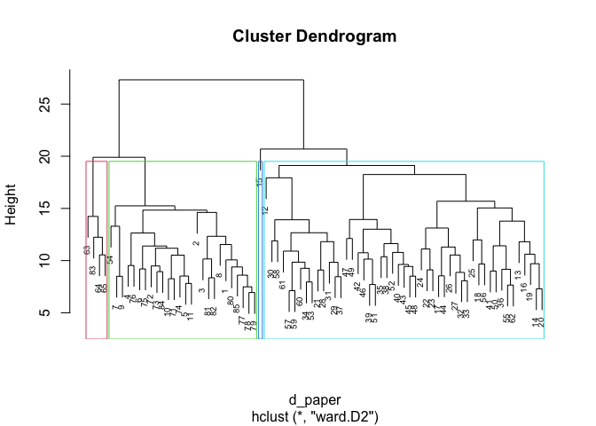<!-- -->

``` r
# visualize the result in a scatter plot swith fviz_cluster()
fviz_cluster(list(data = paper_unlabeled, cluster = cluster_label)) + theme_bw()
```

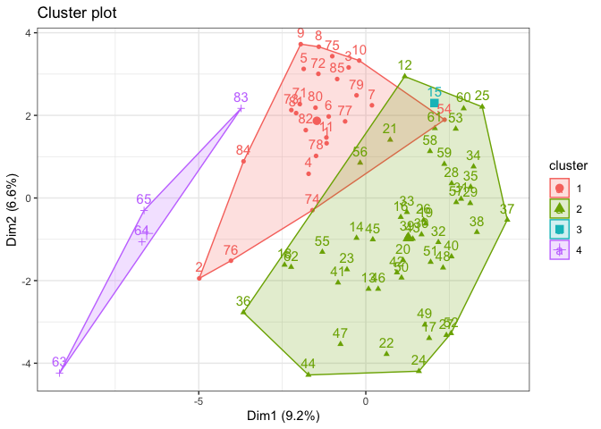<!-- -->

**2. Agglomerative Clustering (agnes)** <br>

``` r
# Cut agnes() tree into 4 groups
hc_paper_final_agnes <- agnes(paper_unlabeled, method = "ward")
cluster_label_agnes <- cutree(as.hclust(hc_paper_final_agnes), k = 4)
table(cluster_label_agnes)
```

    ## cluster_label_agnes
    ##  1  2  3  4 
    ## 26 49  1  4

``` r
# Combine the label
paper_clustered_agnes <- cbind(paper_unlabeled, cluster_label_agnes)

# visualize the results with the fviz_dend
fviz_dend(x = hc_paper_final_agnes, cex = 0.8, lwd = 0.8, k = 4, k_colors = c("red", "green3", "blue", "pink"), rect = TRUE, rect_border = "black")
```

    ## Warning: The `<scale>` argument of `guides()` cannot be `FALSE`. Use "none" instead as
    ## of ggplot2 3.3.4.
    ## ℹ The deprecated feature was likely used in the factoextra package.
    ##   Please report the issue at <]8;;https://github.com/kassambara/factoextra/issueshttps://github.com/kassambara/factoextra/issues]8;;>.

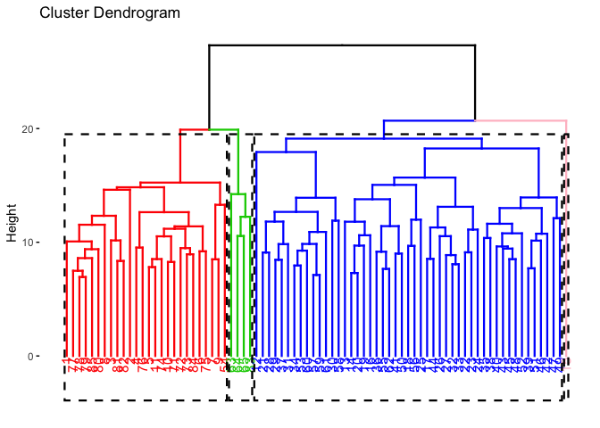<!-- -->

``` r
# Visualize the results with the fviz_cluster
fviz_cluster(list(data = paper_unlabeled, cluster = cluster_label_agnes)) + theme_bw() 
```

<!-- -->

### Divisible Clustering

**3. diana()**

``` r
# Cut diana() tree into 4 groups
hc_paper_final_diana <- diana(paper_unlabeled)
cluster_label_diana <- cutree(as.hclust(hc_paper_final_diana), k = 4)
table(cluster_label_diana)
```

    ## cluster_label_diana
    ##  1  2  3  4 
    ## 72  6  1  1

``` r
# Combine the label
paper_clustered_diana <- cbind(paper_unlabeled,cluster_label_diana)

# Visualize the results with the fviz_dend
fviz_dend(x = hc_paper_final_diana, cex = 0.8, lwd = 0.8, k = 4, k_colors = c("red", "green3", "blue", "pink"), rect = TRUE, rect_border = "black", rect_fill = FALSE)
```

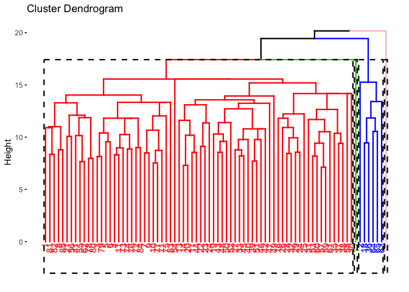<!-- -->

``` r
# Visualize the results with the fviz_cluster
fviz_cluster(list(data = paper_unlabeled, cluster = cluster_label_diana)) + theme_bw() 
```

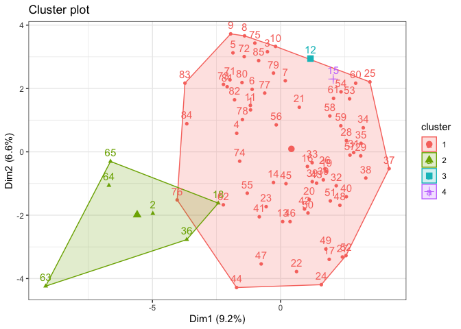<!-- -->
First, the results from the hclust() and agnes() functions are the same.
Second, we would say all the results from the hclust(), agnes(), and
diana() functions don’t have a strong structure of clustering.

### kmeans

Examine the number of examples falling in each group and check the
usefulness of clusters using the size element from the kmeans class.

``` r
kmeans_paper$size
```

    ## [1] 14 40  1 25

Compared to the results of the hierarchical clustering models, the
number of instances of each cluster is in balance. (Note that this
cannot mean a strong clustering structure.)

------------------------------------------------------------------------

## Step 5. Extract and evaluate the Results

Apply all models we created to the original dataset.

### Hierarchical Clustering Algorithms

**1. hclust()**

``` r
set.seed(123)
# Cut tree into 4 groups
hc_paper_final <- hclust(d_paper, method = "ward.D2")
cluster_label <- cutree(hc_paper_final, k = 4)

# Combine the label
paper_clustered_hclust <- cbind(paper[paper$author != "Jay",], cluster_label)
paper_clustered_hclust %>% group_by(cluster_label, author) %>% summarize(n = n())
```

    ## `summarise()` has grouped output by 'cluster_label'. You can override using the
    ## `.groups` argument.

    ## # A tibble: 7 × 3
    ## # Groups:   cluster_label [4]
    ##   cluster_label author       n
    ##           <int> <chr>    <int>
    ## 1             1 dispt       11
    ## 2             1 Hamilton     1
    ## 3             1 Madison     14
    ## 4             2 Hamilton    49
    ## 5             3 Hamilton     1
    ## 6             4 HM           3
    ## 7             4 Madison      1

According to the above table of clustering model with hclust(), the
result that all disputed essays are included in the cluster 1. However,
we can’t conclude that this is 100% accurate, because there are both
Hamilton and Madison elements in the cluster.

**2. agnes()**

``` r
set.seed(123)
# Cut agnes() tree into 4 groups
hc_paper_final_agnes <- agnes(paper_unlabeled, method = "ward")
cluster_label_agnes <- cutree(as.hclust(hc_paper_final_agnes), k = 4)

# Combine the label
paper_clustered_agnes <- cbind(paper[paper$author != "Jay",], cluster_label_agnes)
paper_clustered_agnes %>% group_by(cluster_label_agnes, author) %>% summarize(n = n())
```

    ## `summarise()` has grouped output by 'cluster_label_agnes'. You can override
    ## using the `.groups` argument.

    ## # A tibble: 7 × 3
    ## # Groups:   cluster_label_agnes [4]
    ##   cluster_label_agnes author       n
    ##                 <int> <chr>    <int>
    ## 1                   1 dispt       11
    ## 2                   1 Hamilton     1
    ## 3                   1 Madison     14
    ## 4                   2 Hamilton    49
    ## 5                   3 Hamilton     1
    ## 6                   4 HM           3
    ## 7                   4 Madison      1

The cluster model using agnes() function shows the same result as the
hclust() cluster model.

### Divisible Clustering

**3. diana()**

``` r
# Cut diana() tree into 4 groups
set.seed(123)
hc_paper_final_diana <- diana(paper_unlabeled)
cluster_label_diana <- cutree(as.hclust(hc_paper_final_diana), k = 4)

# Combine the label
paper_clustered_diana <- cbind(paper[paper$author != "Jay",], cluster_label_diana)
paper_clustered_diana %>% group_by(cluster_label_diana, author) %>% summarize(n = n())
```

    ## `summarise()` has grouped output by 'cluster_label_diana'. You can override
    ## using the `.groups` argument.

    ## # A tibble: 8 × 3
    ## # Groups:   cluster_label_diana [4]
    ##   cluster_label_diana author       n
    ##                 <int> <chr>    <int>
    ## 1                   1 dispt       10
    ## 2                   1 Hamilton    47
    ## 3                   1 Madison     15
    ## 4                   2 dispt        1
    ## 5                   2 Hamilton     2
    ## 6                   2 HM           3
    ## 7                   3 Hamilton     1
    ## 8                   4 Hamilton     1

In the above results, we cannot define the authorship of the disputed
essays.

### kmeans

The cluster part of the cluster object is appended into the original
dataset as a separate column.

``` r
set.seed(123)
paper_unlabeled_df <- as.data.frame(paper[paper$author != "Jay",])
nrow(paper_unlabeled_df)
```

    ## [1] 80

``` r
paper_unlabeled_df$cluster <- kmeans_paper$cluster
paper_unlabeled_df %>% group_by(cluster, author) %>% summarize(n = n())
```

    ## `summarise()` has grouped output by 'cluster'. You can override using the
    ## `.groups` argument.

    ## # A tibble: 7 × 3
    ## # Groups:   cluster [4]
    ##   cluster author       n
    ##     <int> <chr>    <int>
    ## 1       1 dispt        1
    ## 2       1 Hamilton    10
    ## 3       1 HM           3
    ## 4       2 Hamilton    40
    ## 5       3 Hamilton     1
    ## 6       4 dispt       10
    ## 7       4 Madison     15

As we can see the above table, we will make two conclusions. <br> 1. One
of the 11 disputed essays are written by Madison because it is in the
cluster 1, which most elements are Madison’s essays. <br> 2. The
authorship of the other essay cannot be defined. Even though it is
possible to say the essay is written by Hamilton because there are 10
essays of Hamilton in the cluster, we cannot say this is 100% true
considering that there are three essays written by both Hamilton and
Madison in the same cluster.

------------------------------------------------------------------------

### Conclusion

<br> 1. The purpose of this analysis is to find the author of each
disputed essay (Hamilton or Madison). <br> - We used these algorithms:
Hierarchical Clustering Algorithms with hclust() and agnes(), Divisive
Clustering Algorithm with diana(), SimpleKMeans(), kmeans(). <br> 2. The
result of kmeans() would be acceptable and understandable. <br> - In
conclusion, we would say one of the essays are written by Madison, while
the others cannot be defined.
